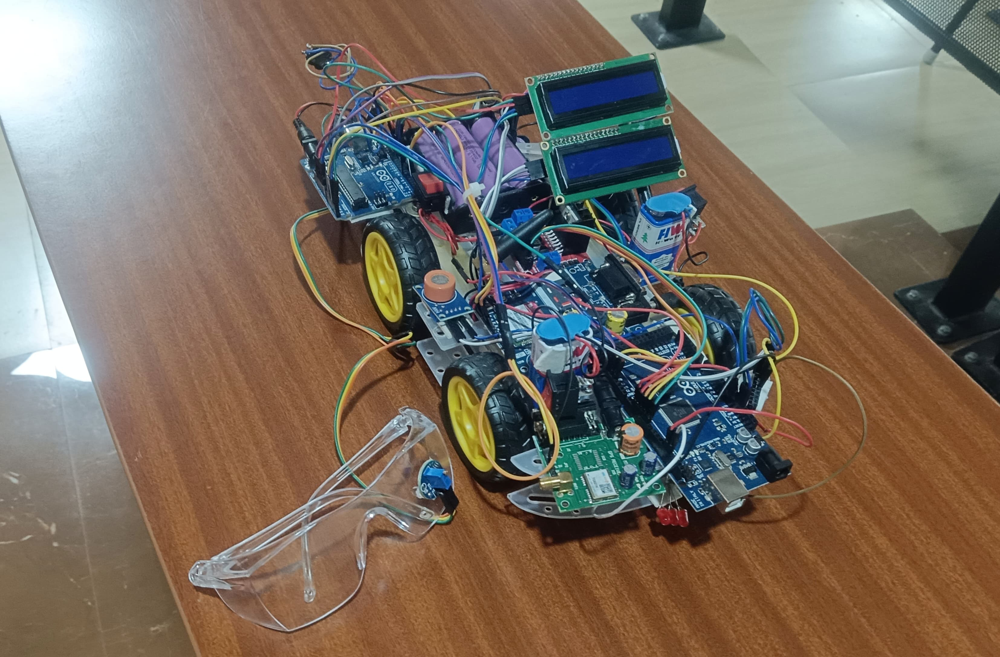

# 🚗 Accident Prevention, Detection & Reporting 🚨

[]()
[]()
[]()

---

## 🔍 Overview

This **embedded systems** project enhances road safety through real-time vehicle accident prevention, detection, and reporting. It integrates sensors (accelerometer, alcohol detector, GPS) with GSM/GPRS communication to proactively monitor and alert stakeholders in case of anomalies or emergencies.

---

## 🚦 Features

- **Accident Detection**: Monitors acceleration thresholds to detect collisions.
- **Drunk Driving Prevention**: Alcohol sensor alerts prevent impaired operation.
- **Speed Regulation**: Alerts for over-speeding using vehicle and GPS data.
- **Emergency Communication**:
  - Sends SMS alerts (accident/drunk-driving alerts).
  - Includes precise GPS coordinates and map links.
  - Auto-dials emergency contacts if necessary.
- **Real-Time Alerts**: Sends notifications to vehicle owner, emergency services, or guardians.
- **Failsafe Measures**: Allows false-alarm cancellation and optional ignition cutoff on high BAC.
- **Google Maps API**: Used Maps Static API to dynamically generate map snapshots based on live GPS coordinates. These snapshots are embedded into emergency SMS alerts to assist responders with quick visual context.


---

## 🛠️ System Architecture

```
[Vehicle Motion] ───> Accelerometer ───┐
├─> Microcontroller ──> GSM/GPRS → Alerts
[Driver Breath] ──> Alcohol Sensor ───┤
│
[Eye Blink] ──────> IR/Eye Sensor ────┘

└─> GPS → Coordinates → SMS
```

---

## 🧩 Components

| Module           | Description                              |
|------------------|------------------------------------------|
| 🧠 MCU            | Microcontroller (e.g., Arduino, STM32)   |
| 📍 GPS Module     | Provides real-time location data         |
| 🔊 GSM/GPRS       | Sends SMS and calls                      |
| ⚙️ Accelerometer  | Detects rapid deceleration/collision     |
| 🍺 Alcohol Sensor | Detects driver intoxication (e.g., MQ-3) |
| 🔔 Buzzer         | Audible alert on detection               |
| 🔁 Relay          | (Optional) Cuts ignition on high BAC     |
| 🖥 LCD Display    | Displays system status and alerts        |

---

## 🚀 Getting Started

1. **Hardware Setup**  
   - Wire sensors to MCU (e.g., accelerometer on INT, alcohol sensor ≥ digital pin).  
   - Connect GPS and GSM modules via UART.  
   - (Optional) Add LCD and relay if needed.

2. **Software Setup**  
   - Clone repo & open project in IDE (Arduino IDE / PlatformIO).  
   - Configure module pins and SMS/call logic.  
   - Upload to microcontroller.

3. **Operation**  
   - Power up the system.  
   - The alcohol sensor locks ignition if BAC is high (optional).  
   - Collision detection triggers SMS/call with GPS location.  
   - Driver can cancel false alarms via reset button.

---

## 📈 How It Works

1. **Continuous Monitoring** – Regular checks on motion and breath.  
2. **Threshold Triggers** – Sensor readings above preset values activate alerts.  
3. **Emergency Alerts** – GSM sends SMS with GPS link; auto-calls if configured.  
4. **False Alarm Handling** – Manual override to prevent unnecessary alerting.

---

## 📷 Demo




[](https://www.youtube.com/watch?v=HL6M6RP4g7w)


---

## 📁 Repository Structure

```
├── src/                # Source code
│   ├── main.cpp        # Core logic
│   ├── sensors/        # Sensor abstractions
│   └── comms/          # GSM/GPS modules
├── hardware/           # Wiring diagrams, schematics
├── assets/             # Diagrams, photos
├── LICENSE             # Apache 2.0 License
└── README.md           # Project overview (this file)
```

---

## 🧪 Testing

- **Unit Tests**: Simulate sensor triggers via serial commands.  
- **Integration Tests**: Field trials with vehicle-mounted prototype.  
- **Edge Cases**: Tested at BAC boundary and minimum collision thresholds.

---

## 📌 Roadmap

- [ ] Add driver drowsiness monitoring (eye-blink sensor).  
- [ ] Implement route deviation detection and auto-call.  
- [ ] Integrate V2V communication for collision avoidance.  
- [ ] Add low-temperature and LPG-leak alerts.

---

## 📝 License

This project is released under the **Apache License 2.0** – see [LICENSE](LICENSE) for details.

---

## 🤝 Contributions

Contributions are welcome! Please:

1. Fork the repo.  
2. Create feature branches.  
3. Submit PRs for review.  
4. Star ⭐ the repo if you found it useful!

---

## 📞 Contact

**Maintainer**: ManiraM-1 (Maniram Tatipamula)   
**Connect via LinkedIn (in profile)**

---

Thank you for checking out this project—drive safe! 🛣️
